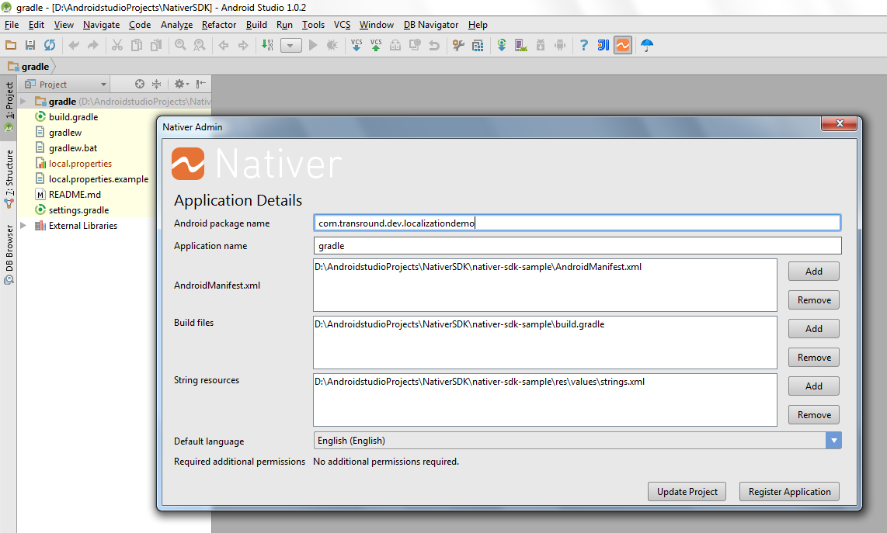

Android on-device localization
=======================================

Adds dynamic string resource management features enabling:

* in-context community translation,
* on-the-fly localized string resource download,
* gesture driven language change by shaking the phone

Supports 70+ languages including Chinese, Right-to-left languages

Instructions
------------

__<<< do not forget: Once you register the plugin and restart Android Studio - you can find the new  plugin in the Tools menu >>>__

In Android Studio 1.0 choose File -> Settings -> Plugins -> Browse repositories -> Android On-Device Resource Localization. 
Then install selected plugin.

After restart Android Studio from Tools menu select “On-device resource localization”.

At the first use you need to register yourself and your app to the localization 
backend service - 90 days trial - no commitment from your side.

Register as new account

Enter your contact details:

Register your app details:

After successful registration - the backend service generates 70+ language resource files for your app. 

Testing: Generate a new APK and load it on your phone.
After you start your app - language manager screen appears: choose developer mode from the menu.

Then in your app all your translatable resources will have a star added to the beginning of the resource string. 
Shake your phone to switch between the original and the test versions. 

Your app is ready for On-device resource localization.
Download the translator app [Nativer from GooglePlay](https://play.google.com/store/apps/details?id=com.transround.nativer&referrer=utm_source%3Dgithub%26utm_medium%3Dreferral%26utm_campaign%3Don-device-leiras) to see the translation experience. 

