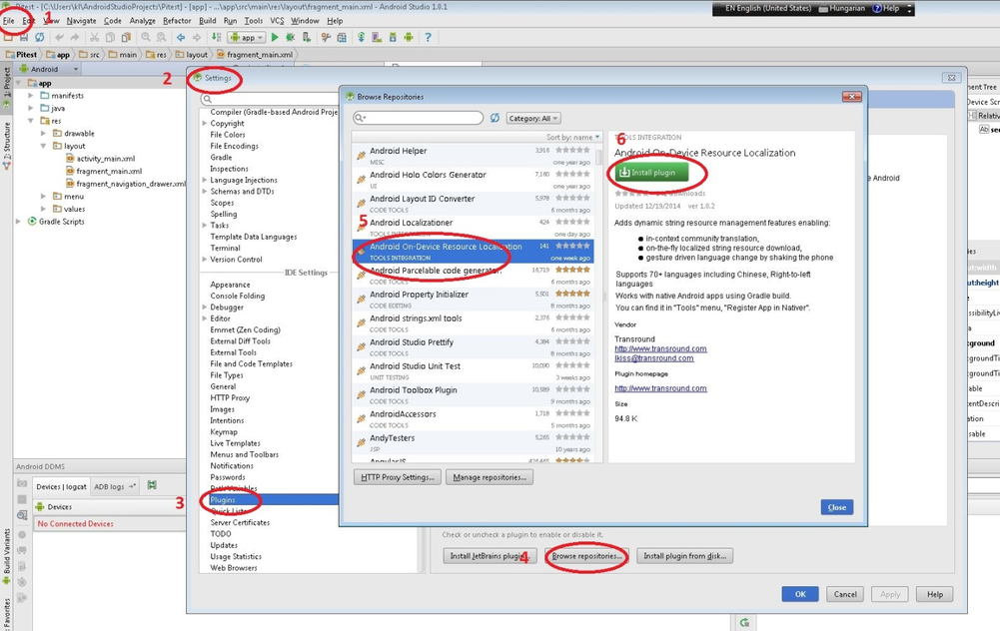
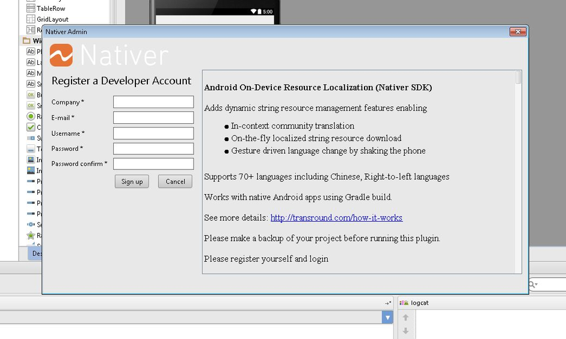
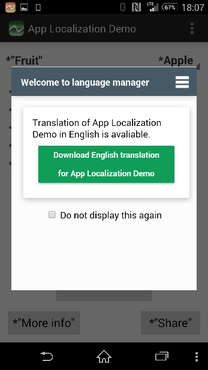
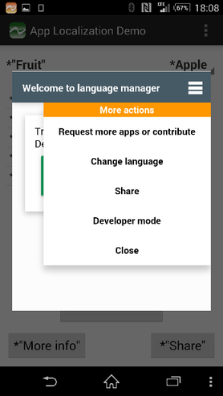
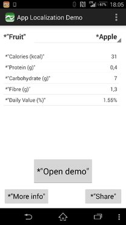

Android on-device resource localization
=======================================

Enabling your users to use their languages within your app. 
It’s less than 20 minutes of your time to add dynamic string resource management to your app to get:

* in-context on the phone community translation,
* on-the-fly localized string resource download,
* gesture driven language change by shaking the phone

Supports 70+ languages including Chinese, Right-to-left languages

How to try it?
------------
In Android Studio choose File -> Settings -> Plugins -> Browse repositories -> Android On-Device Resource Localization and install it. 



Restart Android studio.

After restart the Nativer Admin plugin will be activated in the right pane providing a step by step instruction. (There is no commitment from your side until you launch your app with the Nativer SDK in a public appstore.) 



Testing the integration
------------
Generate a new APK and load it on your phone. (See note for Android Studio 1.1)

After you start your app - Nativer SDK automatically launching the language manager popup screen. From the top right corner menu choose the developer mode.





Each translatable resource is marked with a star at the beginning of the resource string. Shake your phone to switch between the original and the test versions. If the translation scope is ok then your app is ready for On-device resource localization. 

For setting the language scope pls go to http://developer.nativer.com using your registration account.

------------


**Note for Android Studio version 1.1 users**: 

In case you are using Android Studio version 1.1.x and run into error "Error:No such property: bootClasspath for class: com.android.build.gradle.AppPlugin" when building your project then please **follow this workaround** until we fix the issue.

**Modify the gradle version from 1.1.0 to 1.0.0** in your project's build.gradle file.

When the build.gradle file is modfied by the Android Studio plugin it contains the following section

```groovy
    ...
    dependencies {
        classpath 'com.android.tools.build:gradle:1.1.0'
    ...
```

that should be changed as the following

```groovy
    ...
    dependencies {
        classpath 'com.android.tools.build:gradle:1.0.0'
    ...
```

Please carry out a clean build of your project. This workaround should solve the above compilation error.
